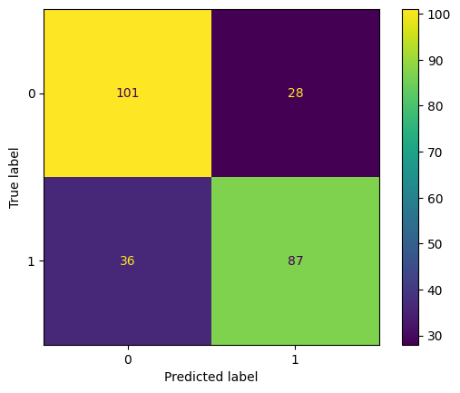

# Therapy Predictor using Machine Learning


---

##  Author  
**Ailya Zainab**  
BSDS-2A  

---

## Overview  

This project implements a complete machine learning pipeline to predict whether an individual seeks mental health treatment based on workplace and personal factors.

The focus of this project is not just model accuracy, but building a **clean, reproducible pipeline** that integrates preprocessing, training, and evaluation in a structured way.

It also includes a **Streamlit web application** that loads the trained model and collects user inputs dynamically for real-time prediction.

---

## Repository Structure  

```
Therapy-Predictor-using-ML/
│
├── app.py
├── survey.csv
├── Mental-Health-Classification.ipynb
├── confusion-matrix.png
├── best_model.joblib
├── model.pkl
├── README.md
```

- `app.py` → Streamlit application for live prediction  
- `survey.csv` → dataset used for training/testing  
- `Mental-Health-Classification.ipynb` → full implementation (pipeline + models + results)  
- `confusion-matrix.png` → final confusion matrix visualization  
- `best_model.joblib` → primary saved final soft-voting model  
- `model.pkl` → fallback model artifact used if `best_model.joblib` is unavailable  
- `README.md` → project documentation  

---

## Dataset  

- **Name:** Mental Health in Tech Survey  
- **Source:** OSMI / Kaggle  
- **Samples:** 1259  
- **Features:** 27  
- **Link:** https://www.kaggle.com/datasets/osmi/mental-health-in-tech-survey

### Target Variable  
`treatment`

- `1` → Yes (sought treatment)  
- `0` → No (did not seek treatment)  

### Notes  
- Mix of numerical and categorical features  
- Missing values present (handled in pipeline)  
- Some noisy values (e.g., unrealistic ages)  

---

## Pipeline Design  

The entire workflow is built using **scikit-learn Pipelines** to ensure consistency and avoid data leakage.

### Train/Test Split

- 80/20 split with fixed `random_state=42`
- **Stratified split** with `stratify=y` to preserve Yes/No class proportion in both train and test sets

This improves fairness and reliability of evaluation by avoiding accidental class imbalance in one split.

### Preprocessing  

**Numerical Data**
- Mean imputation  
- Standard scaling  

**Categorical Data**
- Most frequent imputation  
- One-hot encoding  

Implemented using:
- `Pipeline`
- `ColumnTransformer`

### Feature Cleanup Decisions

Before dropping fields, the notebook inspects missingness/cardinality and then removes:
- `Timestamp`
- `comments`
- `state`

This keeps the model focused on cleaner predictive features.

---

## Models Implemented  

- Logistic Regression  
- Decision Tree  
- K-Nearest Neighbors (KNN)  
- Support Vector Machine (SVM)  

Each model is wrapped inside a pipeline along with preprocessing.

---

## Project Overview

This project predicts whether individuals seek mental health treatment using machine learning models.

### Models Used
- Logistic Regression
- Decision Tree
- KNN
- SVM
- Voting Classifier

---

## Hyperparameter Tuning  

Basic tuning is done using `GridSearchCV`:

- Logistic Regression → `C`  
- Decision Tree → `max_depth`  
- KNN → `n_neighbors`  
- SVM → `kernel`, `C`  

---

## Ensemble Learning  

A **Voting Classifier** is used to combine predictions:

- **Hard Voting** → majority decision  
- **Soft Voting** → probability averaging  

Soft voting is enabled using `probability=True` in SVM.

---

## Evaluation Metrics  

- Accuracy  
- Precision  
- Recall  
- F1 Score  
- ROC-AUC  
- PR-AUC  
- Confusion Matrix  

Notes:
- **ROC-AUC** measures overall class-separation quality across thresholds.
- **PR-AUC** focuses on positive-class performance (treatment seekers), which is important for this problem setting.

---

## Streamlit App Architecture (`app.py`)

The app is designed to stay aligned with the trained model and current dataset.

### 1. Model Loading
- Loads `best_model.joblib` first
- Falls back to `model.pkl` if needed

### 2. Feature Schema Discovery
- Infers expected input columns from the trained model object
- Ensures the app uses the same feature structure as training

### 3. Reference Data Preparation
- Reads `survey.csv`
- Applies the same drop logic used in training (`Timestamp`, `comments`, `state`)
- Uses this cleaned data to infer valid category labels for dropdown inputs

### 4. Categorical Label Normalization
- Normalizes known label variants (for example gender shorthand like `M`/`F`)
- Prevents duplicated/noisy options in UI controls

### 5. Dynamic Form Builder
- Renders form fields for all expected model features
- Uses:
	- numeric input for `Age`
	- dropdowns for categorical columns using inferred labels
	- safe defaults for selected fields (such as `no_employees` defaulting to `26-100`)

### 6. Prediction and Confidence
- Builds a one-row dataframe with exact expected column order
- Runs:
	- `model.predict(...)` for class
	- `model.predict_proba(...)` for confidence score
- Displays prediction outcome + probability in the app

### Why This App Design Is Strong
- Reduces train/inference mismatch risk
- Keeps UI options consistent with real dataset labels
- Improves practical reliability compared to hardcoded 5-feature input forms

---

## Results  

| Model | Accuracy |
|------|--------|
| Logistic Regression | 70.6% |
| Decision Tree | 71.0% |
| KNN | 71.4% |
| SVM | 74.6% |
| Voting (Soft) | 74.6% |

- **Best Individual Model:** SVM (~74.6% accuracy)  
- **Voting Classifier:** similar or slightly improved performance  
- **Soft Voting > Hard Voting**  

---

## Confusion Matrix



From the matrix:
- True Negatives (TN): 101
- False Positives (FP): 28
- False Negatives (FN): 36
- True Positives (TP): 87

This confirms solid overall performance, while also showing that reducing false negatives should remain a priority.

---

## Insights  

- Different models capture different patterns → combining them improves stability  
- SVM performs well with high-dimensional encoded data  
- Decision Tree tends to overfit if not controlled  
- False negatives are important in this problem (missed treatment cases)  

### Key Insight
False negatives are critical in mental health prediction and should be minimized.

---

## Why This Matters

Mental health prediction systems can assist in early detection of individuals needing support, reducing untreated psychological conditions.

This project stands out by emphasizing:
- Fair evaluation with stratified splitting
- Stronger metrics beyond accuracy (ROC-AUC and PR-AUC)
- Reproducible deployment with a saved trained model (`best_model.joblib`)

---

##  How to Run  

```bash
# clone repo
git clone https://github.com/Ailya-Shah/Therapy-Predictor-using-ML.git

# go into folder
cd Therapy-Predictor-using-ML

# install dependencies
pip install pandas numpy scikit-learn matplotlib jupyter joblib streamlit

# run notebook
jupyter notebook

# run streamlit app
streamlit run app.py
```

Open:
```
Mental-Health-Classification.ipynb
```

Run all cells from top to bottom to reproduce the full workflow and generate:
```
best_model.joblib
```

Important:
- Use `streamlit run app.py` for the web app.
- Running `python app.py` shows bare-mode warnings and is not the intended Streamlit execution mode.

The final trained soft-voting model is saved with:
```python
joblib.dump(voting_soft, "best_model.joblib")
```

You can later reload it without retraining:
```python
import joblib
model = joblib.load("best_model.joblib")
```

---

## Requirements  

- Python 3.x  
- pandas  
- numpy  
- scikit-learn  
- matplotlib  
- jupyter  
- joblib  
- streamlit

---

## Conclusion  

This project demonstrates a complete ML pipeline for a real-world classification task.

- Pipeline ensures reproducibility  
- SVM gave best standalone results  
- Voting classifier improved overall robustness  

The project highlights the importance of combining models and handling mixed-type data effectively.

---

## Notes  

- All preprocessing is done inside pipelines  
- No data leakage  
- Fully reproducible workflow  
- Developed as part of a Machine Learning lab  

---