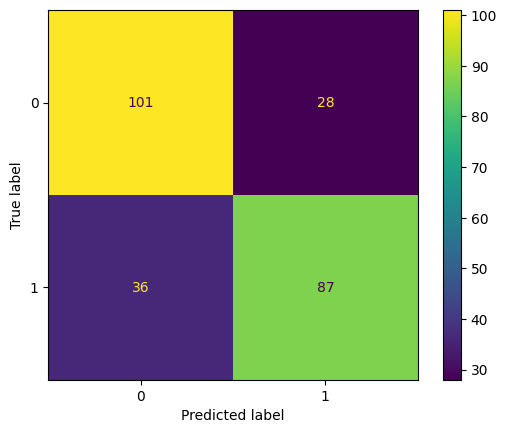

# Therapy Predictor using Machine Learning


---

## Author
**Ailya Zainab**
BSDS-2A

---

## Overview

This project implements a complete machine learning pipeline to predict whether an individual seeks mental health treatment, based on workplace and personal factors from the OSMI *Mental Health in Tech* survey.

The focus is not just accuracy, but a **clean, reproducible, leakage-aware pipeline** — including honest data-quality cleanup and an explicit check of whether the strongest feature is leaking the answer. A **Streamlit web app** loads the trained model and collects user inputs dynamically for real-time prediction.

---

## Repository Structure

```
Therapy-Predictor-using-ML/
│
├── app.py
├── survey.csv
├── Mental-Health-Classification.ipynb
├── misc/
│   └── confusion-matrix.png
├── trained_models/
│   └── best_model.joblib
├── README.md
├── survey_cleaned.csv     # cleaned data (ages clipped, gender normalized, junk columns dropped)
```

- `app.py` → Streamlit application for live prediction
- `survey.csv` → dataset used for training/testing
- `Mental-Health-Classification.ipynb` → full implementation (cleaning + pipeline + models + leakage check + results)
- `misc/confusion-matrix.png` → final confusion matrix
- `trained_models/best_model.joblib` → saved soft-voting model
- `README.md` → project documentation

---

## Dataset

- **Name:** Mental Health in Tech Survey
- **Source:** OSMI / Kaggle
- **Samples:** 1259 (≈1251 after age cleanup)
- **Features:** 27
- **Link:** https://www.kaggle.com/datasets/osmi/mental-health-in-tech-survey

### Target Variable
`treatment` — `1` = sought treatment, `0` = did not.

### Known data-quality issues (and how they're handled)
This is real survey data, and it's messy in specific ways the pipeline addresses up front:
- **`Age`** contains impossible values (negative ages and values in the billions). Rows outside a plausible **18–80** band are removed (~8 rows).
- **`Gender`** is free-text with ~49 variants (`M`, `male`, `Cis Male`, `woman`, …). These are normalized to **Male / Female / Other**.
- **Missing values** in other fields are imputed inside the pipeline (mean for numeric, most-frequent for categorical).

---

## Pipeline Design

The workflow is built with **scikit-learn Pipelines** so all fitting (imputation, scaling, encoding) happens inside cross-validation — no data leakage from preprocessing.

### Train/Test Split
- 80/20 split, fixed `random_state=42`
- **Stratified** (`stratify=y`) to preserve the Yes/No class balance in both sets

### Preprocessing
| Numerical | Categorical |
|---|---|
| Mean imputation | Most-frequent imputation |
| Standard scaling | One-hot encoding (`handle_unknown="ignore"`) |

Implemented with `Pipeline` + `ColumnTransformer`.

### Columns dropped before modelling
`Timestamp`, `comments`, `state` — high-missingness or non-predictive identifiers.

---

## Feature-validity check: is `work_interfere` leaking?

`work_interfere` asks whether a mental health condition interferes with work — which partly **presupposes a condition** and is closely tied to the outcome. Rather than assume, the notebook **re-trains the model without it** and compares:

| Variant | Accuracy | Recall | ROC-AUC |
|---|---|---|---|
| **With** `work_interfere` | ~0.75 | ~0.72 | ~0.85 |
| **Without** `work_interfere` | ~0.73 | ~0.74 | ~0.79 |

**Finding:** removing it lowers ROC-AUC modestly and accuracy by ~2 points, but the model does **not** collapse, and recall actually holds up. So `work_interfere` is the single most predictive field while being partly a proxy for the outcome — reported transparently rather than hidden.

---

## Models Implemented

- Logistic Regression
- Decision Tree
- K-Nearest Neighbors (KNN)
- Support Vector Machine (SVM)
- **Voting Classifier** (hard + soft)

Each is wrapped in a pipeline with the shared preprocessor.

### Hyperparameter Tuning (`GridSearchCV`, 5-fold)
- Logistic Regression → `C`
- Decision Tree → `max_depth`
- KNN → `n_neighbors`
- SVM → `C`, `kernel`

### Ensemble
- **Hard voting** — majority decision
- **Soft voting** — probability averaging (SVM uses `probability=True`); soft voting is the final saved model.

---

## Evaluation Metrics

Accuracy · Precision · Recall · F1 · **ROC-AUC** · **PR-AUC** · Confusion Matrix

- **ROC-AUC** measures class-separation across thresholds.
- **PR-AUC** focuses on the positive (treatment-seeking) class — the more relevant view here, since **missing a treatment case (false negative) is the costlier error.**

---

## Results

| Model | Accuracy | ROC-AUC |
|------|--------|--------|
| Logistic Regression | ~0.75 | ~0.83 |
| Decision Tree | ~0.74 | ~0.80 |
| KNN | ~0.71 | ~0.76 |
| SVM | ~0.75 | ~0.84 |
| **Voting (Soft)** | **~0.77** | **~0.85** |

- **Best individual model:** SVM
- **Soft-voting ensemble** edges out the individual models on accuracy and ROC-AUC, and is the saved final model.
- *(Run the notebook for exact figures; values vary slightly with library versions.)*

### Confusion Matrix



False negatives (individuals who needed treatment but weren't flagged) are the priority error to reduce in this problem setting.

---

## Streamlit App (`app.py`)

The app is designed to stay aligned with the trained model and dataset:

1. **Model loading** — loads `trained_models/best_model.joblib`.
2. **Feature schema discovery** — infers expected input columns from the fitted model, so the form matches training exactly (no hardcoded feature list).
3. **Reference data prep** — reads `survey.csv`, applies the same drop logic, and derives valid dropdown labels from real data.
4. **Categorical normalization** — collapses noisy labels (e.g. gender shorthand) for clean UI options.
5. **Dynamic form** — numeric input for `Age`, dropdowns for categoricals, sensible defaults.
6. **Prediction + confidence** — `predict` for class, `predict_proba` for probability.

**Why this matters:** inferring the schema from the model (rather than hardcoding) reduces train/inference mismatch — a common and silent source of deployment bugs.

---

## How to Run

```bash
git clone https://github.com/Ailya-Shah/Therapy-Predictor-using-ML.git
cd Therapy-Predictor-using-ML
pip install pandas numpy scikit-learn matplotlib jupyter joblib streamlit

# reproduce the full workflow (cleaning -> models -> leakage check -> saved model)
jupyter notebook Mental-Health-Classification.ipynb   # run all cells

# launch the web app
streamlit run app.py
```

> Use `streamlit run app.py` (not `python app.py`). Running all notebook cells regenerates `trained_models/best_model.joblib`.

---

## Limitations & Future Work

- **`work_interfere` is partly a proxy for the outcome** — reported transparently; a stricter version of the project would model treatment-seeking from purely *workplace-environment* features only.
- **Modest sample size (~1.25k)** and **self-reported survey data** limit generalisation; this is a tech-industry, largely Western sample.
- **Class signal is limited** — ~75–77% accuracy is honest for this dataset; chasing higher numbers usually means reintroducing leakage.
- **Future work:** threshold tuning to prioritise recall (reduce false negatives), feature engineering, and calibration of predicted probabilities.

---

## Notes

- All preprocessing happens inside pipelines — no leakage from imputation/scaling/encoding.
- Data-quality cleanup (ages, gender) is explicit and reproducible.
- The strongest feature is stress-tested for leakage rather than taken at face value.
- Fully reproducible: run the notebook top to bottom.

*Developed as part of a Machine Learning lab.*
